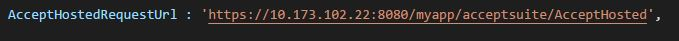
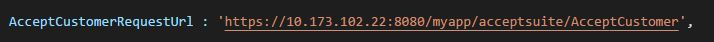
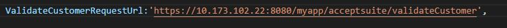

# Accept Suite Integration with Express.js  WEB API

## Getting Started

These instructions will get you a copy of the project up and running on your local machine for development and testing purposes. See deployment for notes on how to deploy the project on a live system.

## Prerequisite:
*	Node.js 4.1.2 or higher
*	Sublime Text/Visual studio code 2017 or any HTML editor.
*	Express.js

## Very detailed explanation of each product type.
Authorized.Net Accept suite has below products.
*	Accept JS
*	Accept UI
*	Accept Hosted
*	Accept Customer

Detailed explanation of each product are available in the below links.
https://developer.authorize.net/api/reference/features/accept.html
https://developer.authorize.net/api/reference/features/acceptjs.html
https://developer.authorize.net/api/reference/features/accept_hosted.html
https://developer.authorize.net/api/reference/features/customer_profiles.html#Using_the_Accept_Customer_Hosted_Form

## Integration
Constants.js file consists of required URLs that are used for WEB API calls and constant parameters that are used throughout the application.

URL format when deployed using express.js 
https://10.173.102.22:1482/index_all.html
Below are the sample URLs of web api methods

* AcceptJSRequestUrl : URL to invoke Accept JS web service on payment.

* AcceptHostedRequestUrl : URL to get the token value for Accept Hosted.

* AcceptCustomerRequestUrl : URL to get the token value for Accept Customer.

* ValidateCustomerRequestUrl : URL to invoke a web api method to validated customer ID.

 

The following are the parameters with values that remains constant throughout the application. These parameters are used in script through Ajax calls for performing payments.

* ClientKey

* ApiLoginID

* ApiTransactionKey

### Steps to deploy the application in Express.js

*  Create a folder to your local system	
*  Open the Node.js command prompt
*  give the path to the newly created local folder
*  Run the command "npm init"
* give "entry point: as server.js"
* type yes & then press enter
* run the command "npm install express"
## Example:-
C:\Program Files\nodejs>cd C:\Users\nacharje\Node\test

C:\Users\nacharje\Node\test>npm init
This utility will walk you through creating a package.json file.
It only covers the most common items, and tries to guess sensible defaults.

See `npm help json` for definitive documentation on these fields
and exactly what they do.

Use `npm install <pkg>` afterwards to install a package and
save it as a dependency in the package.json file.

Press ^C at any time to quit.
package name: (test)
version: (1.0.0)
description:
entry point: (index.js) server.js
test command:
git repository:
keywords:
author:
license: (ISC)
About to write to C:\Users\nacharje\Node\test\package.json:

{
  "name": "test",
  "version": "1.0.0",
  "description": "",
  "main": "server.js",
  "scripts": {
    "test": "echo \"Error: no test specified\" && exit 1"
  },
  "author": "",
  "license": "ISC"
}

Is this ok? (yes) yes

C:\Users\nacharje\Node\test> npm install express
npm notice created a lockfile as package-lock.json. You should commit this file.
npm WARN test@1.0.0 No description
npm WARN test@1.0.0 No repository field.

+ express@4.16.4
added 48 packages in 13.406s

C:\Users\nacharje\Node\test>

* copy the myapp folder to the newly created folder
* copy the expree-sendfile folder to the newly created folder 
* open "constants.js"  file  & modifie the  below   url by changing only the ip address(10.173.102.22) with your local syatem ip address.(open cmmond prompt, type ipconfig, find your system ip address)
                                                                                                                                  
 AcceptJSRequestUrl : 'https://10.173.102.22:8080/myapp/acceptsuite/AcceptJs',

   AcceptHostedRequestUrl : 'https://10.173.102.22:8080/myapp/acceptsuite/AcceptHosted',

   AcceptCustomerRequestUrl : 'https://10.173.102.22:8080/myapp/acceptsuite/AcceptCustomer',

   ValidateCustomerRequestUrl:'https://10.173.102.22:8080/myapp/acceptsuite/validateCustomer',

* run the "acceptsuite.js "inside myapp folder using the  command "node acceptsuite.js"
* run the "server.js"  inside express-sendfile using the command "node server.js".

## browse the website

Sample URL: https://10.173.102.22:1482/index_all.html

