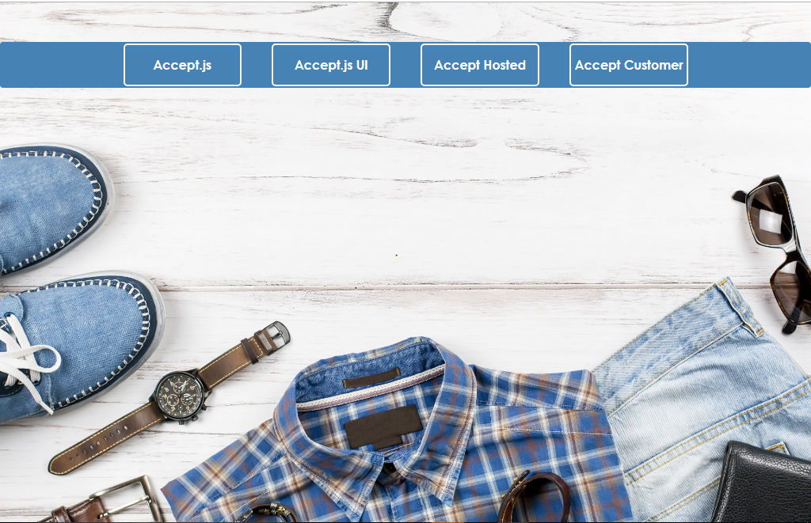

# Accept Suite Integration with .Net Core WEB API

## Prerequisite:
*	Windows 10 Professional
*	Sublime Text or any HTML editor.
*	Internet Information Services 10

## Very detailed explanation of each product type.
Authorized.Net Accept suite has below products.
*	Accept JS
*	Accept UI
*	Accept Hosted
*	Accept Customer

Detailed explanation of each product are available in the below links.
https://developer.authorize.net/api/reference/features/accept.html
https://developer.authorize.net/api/reference/features/acceptjs.html
https://developer.authorize.net/api/reference/features/accept_hosted.html
https://developer.authorize.net/api/reference/features/customer_profiles.html#Using_the_Accept_Customer_Hosted_Form

## Web API Calls Integration with UI Application

* Constants.js file contains keys where WEB API URL's can be updated. 

* Open the folder **AcceptSuite-DotNetCore-WebAPI**

* Detailed steps are explained on how to deploy on IIS.

* Once deployed Successfully , update the URL's in Constants.js file as described below.

The URLs should be provided with IP address and API service site port number in the following format.

**https://IPAddress:PortNumber/api/AcceptSuite/<ApiMethodName>**

* AcceptJSRequestUrl : URL to invoke Accept JS web service.

	**Sample URL: https://IPAddress:PortNumber/api/AcceptSuite/AcceptJS**

* AcceptHostedRequestUrl : URL to get the token value for Accept Hosted.

	**Sample URL: https://IPAddress:PortNumber/api/AcceptSuite/AcceptHosted**

* AcceptCustomerRequestUrl : URL to get the token value for Accept Customer.

	**Sample URL: https://IPAddress:PortNumber/api/AcceptSuite/AcceptCustomer**

* ValidateCustomerRequestUrl : URL to invoke a web api method to validate customer ID.

	**Sample URL: https://IPAddress:PortNumber/api/AcceptSuite/ValidateCustomer**

 

The following are the parameters with values that remains constant throughout the application. These parameters are used in script through Ajax calls for performing payments.

* ClientKey 

* ApiLoginID

* ApiTransactionKey

### Create Website on IIS

*	Open IIS as Administrator.

*	Right click on sites and select “Add Website”. 

*	Provide Site name and physical path to the app’s deployment folder(C:\inetpub\wwwroot\Publish)

*	Choose https binding.

* 	Select SSL Certificate from drop down.

*   Click OK.

	

## browse the website

Sample URL: https://10.173.192.248:5008/index_all.html

